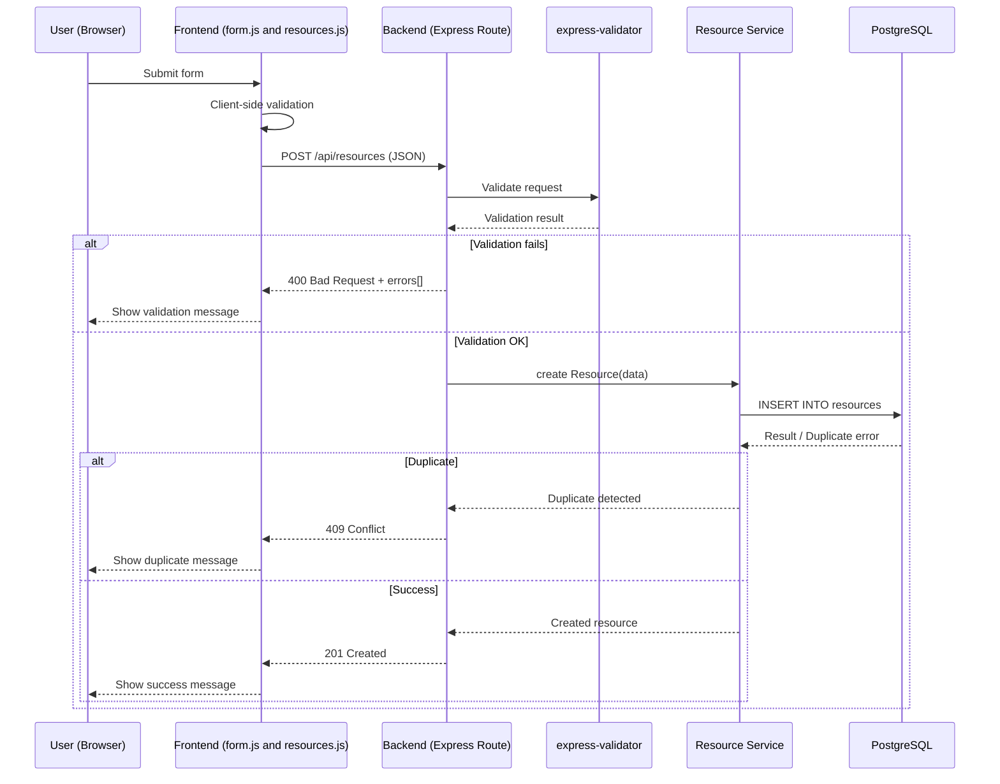
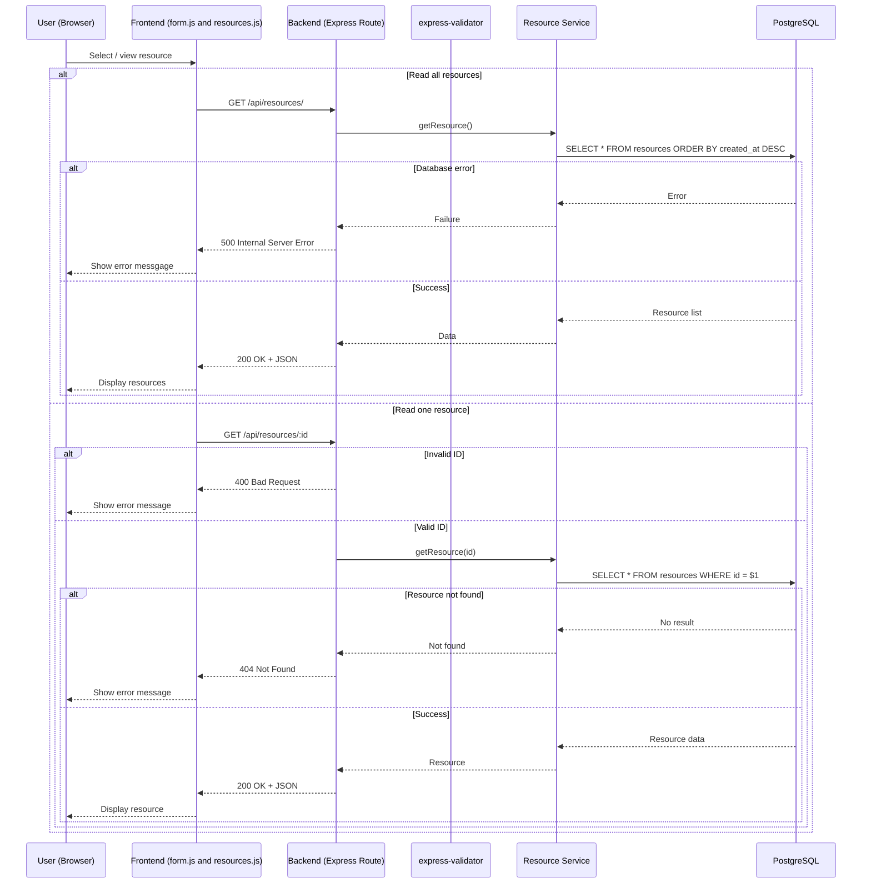
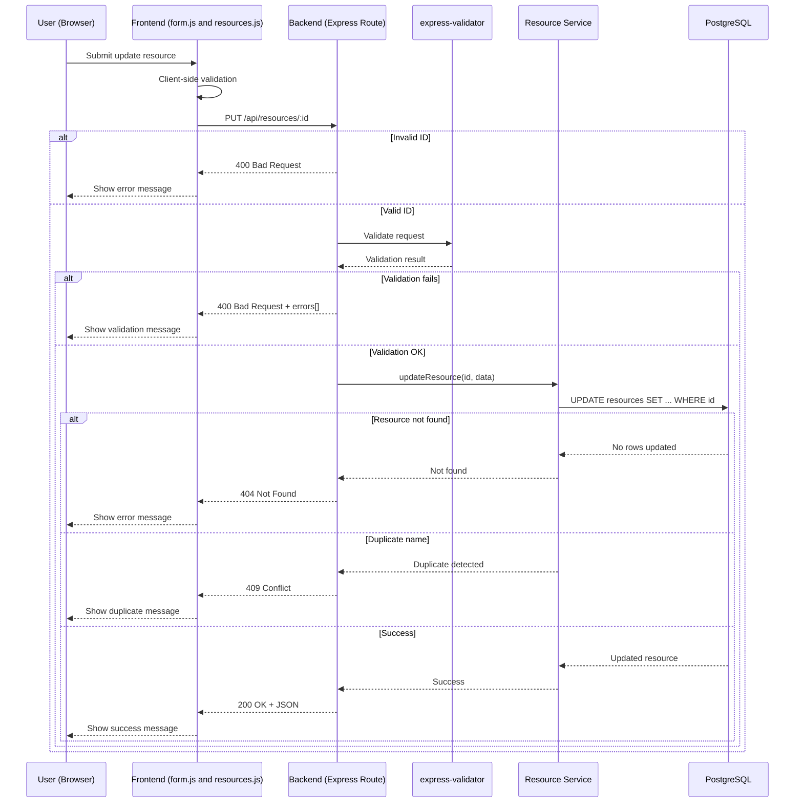
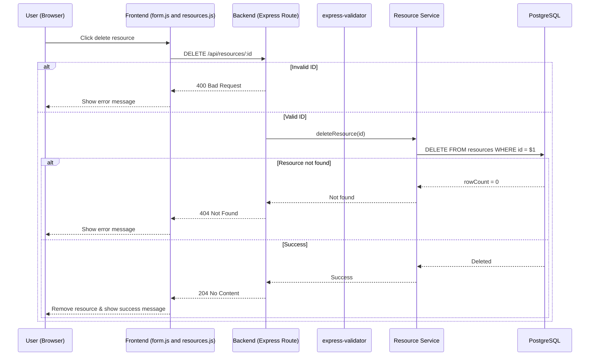

# CREATE

```mermaid
sequenceDiagram
participant U as User (Browser)
participant F as Frontend (form.js and resources.js)
participant B as Backend (Express Route)
participant V as express-validator
participant S as Resource Service
participant DB as PostgreSQL

U->>F: Submit form
F->>F: Client-side validation
F->>B: POST /api/resources (JSON)

B->>V: Validate request
V-->>B: Validation result

alt Validation fails
    B-->>F: 400 Bad Request + errors[]
    F-->>U: Show validation message
else Validation OK
    B->>S: create Resource(data)
    S->>DB: INSERT INTO resources
    DB-->>S: Result / Duplicate error

    alt Duplicate
        S-->>B: Duplicate detected
        B-->>F: 409 Conflict
        F-->>U: Show duplicate message
    else Success
        S-->>B: Created resource
        B-->>F: 201 Created
        F-->>U: Show success message
    end
end
```

# READ

```mermaid
sequenceDiagram
participant U as User (Browser)
participant F as Frontend (form.js and resources.js)
participant B as Backend (Express Route)
participant V as express-validator
participant S as Resource Service
participant DB as PostgreSQL

U->>F: Select / view resource

alt Read all resources
    F->>B: GET /api/resources/
    B->>S: getResource()
    S->>DB: SELECT * FROM resources ORDER BY created_at DESC

    alt Database error
        DB-->>S: Error
        S-->>B: Failure
        B-->>F: 500 Internal Server Error
        F-->>U: Show error messgage
    else Success
        DB-->>S: Resource list
        S-->>B: Data
        B-->>F: 200 OK + JSON
        F-->>U: Display resources
    end

else Read one resource
    F->>B: GET /api/resources/:id

    alt Invalid ID
        B-->>F: 400 Bad Request
        F-->>U: Show error message
    else Valid ID
        B->>S: getResource(id)
        S->>DB: SELECT * FROM resources WHERE id = $1

        alt Resource not found
            DB-->>S: No result
            S-->>B: Not found
            B-->>F: 404 Not Found
            F-->>U: Show error message
        else Success
            DB-->>S: Resource data
            S-->>B: Resource
            B-->>F: 200 OK + JSON
            F-->>U: Display resource
        end
    end
end
```

# UPDATE

```mermaid
sequenceDiagram
participant U as User (Browser)
participant F as Frontend (form.js and resources.js)
participant B as Backend (Express Route)
participant V as express-validator
participant S as Resource Service
participant DB as PostgreSQL

U->>F: Submit update resource
F->>F: Client-side validation
F->>B: PUT /api/resources/:id

alt Invalid ID
    B-->>F: 400 Bad Request
    F-->>U: Show error message
else Valid ID
    B->>V: Validate request
    V-->>B: Validation result

    alt Validation fails
        B-->>F: 400 Bad Request + errors[]
        F-->>U: Show validation message
    else Validation OK
        B->>S: updateResource(id, data)
        S->>DB: UPDATE resources SET ... WHERE id

        alt Resource not found
            DB-->>S: No rows updated
            S-->>B: Not found
            B-->>F: 404 Not Found
            F-->>U: Show error message
        else Duplicate name
            S-->>B: Duplicate detected
            B-->>F: 409 Conflict
            F-->>U: Show duplicate message
        else Success
            DB-->>S: Updated resource
            S-->>B: Success
            B-->>F: 200 OK + JSON
            F-->>U: Show success message
        end
    end
end
```

# DELETE

```mermaid
sequenceDiagram
participant U as User (Browser)
participant F as Frontend (form.js and resources.js)
participant B as Backend (Express Route)
participant V as express-validator
participant S as Resource Service
participant DB as PostgreSQL

U->>F: Click delete resource
F->>B: DELETE /api/resources/:id

alt Invalid ID
    B-->>F: 400 Bad Request
    F-->>U: Show error message
else Valid ID
    B->>S: deleteResource(id)
    S->>DB: DELETE FROM resources WHERE id = $1

    alt Resource not found
        DB-->>S: rowCount = 0
        S-->>B: Not found
        B-->>F: 404 Not Found
        F-->>U: Show error message
    else Success
        DB-->>S: Deleted
        S-->>B: Success
        B-->>F: 204 No Content
        F-->>U: Remove resource & show success message
    end
end
```
